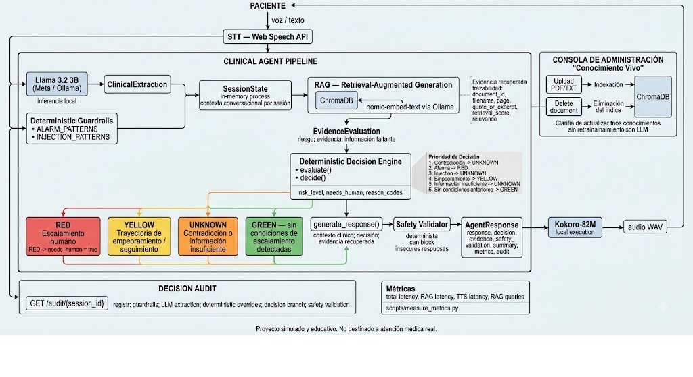

# Tech Sphere Clinical Agent 2026

Agente conversacional postoperatorio educativo en español, desarrollado para el **Tech Sphere Challenge 2026**.

El sistema combina conversación por voz, extracción de información clínica, recuperación aumentada por conocimiento (RAG), reglas deterministas de seguridad y escalamiento, y trazabilidad completa de las decisiones.

> ⚠️ **Proyecto simulado y educativo.** Este sistema no está diseñado ni debe utilizarse para atención médica real, diagnóstico, tratamiento ni toma de decisiones clínicas.

---

## ¿Qué hace?

El agente acompaña una conversación postoperatoria y transforma el lenguaje libre del paciente en un estado clínico estructurado.

A partir de cada turno:

1. identifica síntomas e información clínica relevante;
2. conserva el contexto de la conversación;
3. recupera evidencia desde el conocimiento médico cargado;
4. evalúa riesgo y datos faltantes;
5. determina si corresponde escalar a atención humana;
6. genera una respuesta fundamentada para el paciente;
7. valida la respuesta mediante reglas de seguridad;
8. registra una traza auditable del proceso.

Una decisión clínica **no depende exclusivamente del LLM**. El modelo se utiliza para interpretar el lenguaje del paciente, mientras que la clasificación de riesgo, los guardrails y la validación de seguridad permanecen fuera del modelo y siguen reglas deterministas.

---

## Arquitectura



Versión en texto del mismo flujo, para lectura sin imágenes:

```text
                         ┌─────────────────────┐
                         │      Paciente       │
                         │  voz / texto (ES)   │
                         └──────────┬──────────┘
                                    │
                                    ▼
                         ┌─────────────────────┐
                         │    ClinicalAgent    │
                         └──────────┬──────────┘
                                    │
                 ┌──────────────────┴──────────────────┐
                 │                                     │
                 ▼                                     ▼
       ┌───────────────────┐                 ┌───────────────────┐
       │ Extracción clínica│                 │ Guardrails sobre  │
       │ Llama 3.2 / Ollama│                 │ mensaje original  │
       └─────────┬─────────┘                 └─────────┬─────────┘
                 │                                     │
                 └──────────────────┬──────────────────┘
                                    ▼
                         ┌─────────────────────┐
                         │ Estado de sesión    │
                         │ + contexto clínico  │
                         └──────────┬──────────┘
                                    │
                                    ▼
                         ┌─────────────────────┐
                         │        RAG          │
                         │ ChromaDB +          │
                         │ nomic-embed-text    │
                         └──────────┬──────────┘
                                    │
                                    ▼
                         ┌─────────────────────┐
                         │ EvidenceEvaluation  │
                         │ riesgo / evidencia  │
                         │ información faltante│
                         └──────────┬──────────┘
                                    │
                                    ▼
                         ┌─────────────────────┐
                         │ Decision            │
                         │ determinista        │
                         │ risk + escalation   │
                         └──────────┬──────────┘
                                    │
                                    ▼
                         ┌─────────────────────┐
                         │ Generación respuesta│
                         │ + evidencia citada  │
                         └──────────┬──────────┘
                                    │
                                    ▼
                         ┌─────────────────────┐
                         │ Safety Validator    │
                         │ reglas deterministas│
                         └──────────┬──────────┘
                                    │
                                    ▼
                         ┌─────────────────────┐
                         │ Respuesta + audio   │
                         │ + auditoría + métricas│
                         └─────────────────────┘
```

### Flujo de procesamiento

El pipeline de `ClinicalAgent.answer()` ejecuta las siguientes etapas:

```text
1. extract_clinical()
        ↓
2. merge_clinical_state()
        ↓
3. rag_store.query()
        ↓
4. evaluate()
        ↓
5. decide()
        ↓
6. generate_response()
        ↓
7. validate_safety()
        ↓
   AgentResponse
```

### Una sola llamada al LLM por turno

El LLM tiene una responsabilidad deliberadamente acotada: **extraer información clínica estructurada del lenguaje natural**.

La clasificación de riesgo, el escalamiento y la validación de seguridad no se delegan al modelo.

Esto reduce:

* superficie de alucinación;
* latencia;
* dependencia del comportamiento probabilístico del modelo;
* complejidad de auditoría.

Si el LLM no está disponible o devuelve una respuesta JSON inválida, el sistema dispone de un fallback determinista para mantener operativo el pipeline.

---

## Modelo de lenguaje

El proyecto utiliza:

**Llama 3.2 3B — Meta — Ollama — inferencia local**

La elección responde a tres objetivos:

* utilizar una familia de modelos permitida por el reto;
* mantener el costo de inferencia en `$0`;
* ejecutar la extracción localmente sin depender de una API externa durante la evaluación.

El modelo no toma directamente la decisión de riesgo. Su salida se valida mediante Pydantic y posteriormente pasa por los mecanismos deterministas del agente.

### Configuración

Para desactivar el uso del LLM durante pruebas:

```sh
CLINICAL_AGENT_USE_LLM=0 uvicorn clinical_agent.main:app --reload --port 8000
```

Para inspeccionar el proceso de extracción:

```sh
CLINICAL_AGENT_DEBUG_LLM=1 uvicorn clinical_agent.main:app --reload --port 8000
```

---

## RAG y conocimiento médico

El conocimiento se almacena localmente mediante:

* **ChromaDB** como vector store persistente.
* **nomic-embed-text** mediante Ollama para embeddings.
* PDF y TXT como fuentes de conocimiento.
* recuperación `top-k`, con `top_k=4` por defecto.

Cada elemento recuperado conserva información de trazabilidad:

```text
document_id
filename
page
chunk_id
quote_or_excerpt
retrieval_score
relevance
```

El texto se divide utilizando:

```text
chunk_size = 120 tokens
overlap    = 24 tokens
```

La separación por página se conserva para que una evidencia pueda rastrearse hasta su documento y página de origen.

La colección se persiste en:

```text
./data/chroma
```

La ubicación puede modificarse mediante:

```text
CHROMA_PERSIST_DIR
```

y el modelo de embeddings mediante:

```text
EMBEDDING_MODEL
```

### Configuración

```sh
cp .env.example .env
```

---

## Conocimiento vivo

El conocimiento no está limitado al corpus inicial.

La consola permite incorporar y retirar documentos durante la ejecución del sistema.

### Incorporar conocimiento

```http
POST /knowledge/upload
```

También disponible mediante:

```http
POST /documents
```

### Eliminar conocimiento

```http
DELETE /knowledge/{document_id}
```

Cuando un documento es eliminado, deja de estar disponible para futuras recuperaciones.

Este comportamiento está cubierto por una prueba de ciclo completo:

```text
subir documento
      ↓
responder utilizando su evidencia
      ↓
eliminar documento
      ↓
responder sin esa evidencia
```

---

## Voz

La interacción de voz está separada en dos componentes.

### TTS — Kokoro-82M

La respuesta del agente puede convertirse a voz utilizando **Kokoro-82M**.

Características:

* 82M de parámetros;
* ejecución local;
* CPU;
* salida WAV a 24 kHz;
* sin necesidad de token de Hugging Face;
* voces disponibles en español.

Voz predeterminada:

```text
ef_dora
```

También se encuentran disponibles voces como:

```text
em_alex
em_santa
```

El sistema expone:

```http
GET /tts/status
```

para consultar el estado del componente y:

```http
POST /tts
```

para sintetizar texto directamente.

El endpoint clínico también puede solicitar respuesta hablada:

```http
POST /agent/respond?voice=true
```

En ese caso, la respuesta incluye el audio y registra la latencia de síntesis dentro de las métricas del turno.

La capa TTS es opcional: si Kokoro no está disponible, el pipeline clínico continúa funcionando y devuelve la respuesta textual junto con el error de voz correspondiente.

### STT — voz del paciente

La consola utiliza actualmente la **Web Speech API** del navegador para capturar y transcribir la voz del paciente.

```text
Paciente habla
      ↓
Web Speech API
      ↓
texto en español
      ↓
ClinicalAgent
```

Esta pieza no forma parte del pipeline local: depende del navegador y de conectividad.

La arquitectura permite sustituirla posteriormente por una implementación basada en Whisper local u otro proveedor de STT.

---

## Lógica de riesgo y escalamiento

La decisión de riesgo es determinista y se ejecuta independientemente de la decisión del LLM.

La prioridad actual es:

1. **Contradicción entre turnos**

   * `UNKNOWN`
   * solicita aclaración.

2. **Señal de alarma**

   * `RED`
   * `needs_human=True`.

3. **Intento de prompt injection**

   * `UNKNOWN`
   * la instrucción manipuladora no se ejecuta.

4. **Trayectoria de empeoramiento**

   * `YELLOW`.

5. **Información insuficiente**

   * `UNKNOWN`
   * solicita los datos necesarios.

6. **Sin condiciones anteriores**

   * `GREEN`.

Entre las señales de alarma contempladas se encuentran:

* sangrado abundante;
* fiebre alta;
* dificultad respiratoria;
* dolor de pecho;
* confusión.

La intención es que una señal de seguridad detectada por los guardrails no pueda ser eliminada posteriormente por la salida del LLM.

---

## Guardrails y seguridad

El sistema utiliza dos capas conceptualmente diferentes.

### Guardrails

Son controles duros y deterministas.

Los patrones de:

```text
ALARM_PATTERNS
INJECTION_PATTERNS
```

se ejecutan sobre el mensaje original del paciente.

La información detectada se combina posteriormente con la extracción del LLM, pero los guardrails pueden **agregar señales de seguridad y nunca eliminarlas**.

### Handrails

La extracción realizada por Llama 3.2 funciona como una capa flexible de interpretación.

El modelo puede interpretar expresiones naturales y completar el estado clínico, pero no tiene autoridad para determinar directamente el `risk_level`.

---

## Ventana de auditoría

Cada turno genera una estructura `DecisionAudit`.

La auditoría permite reconstruir:

* qué guardrails fueron evaluados;
* cuáles se activaron;
* qué información produjo el LLM;
* qué respuesta devolvió el modelo;
* qué añadió el procesamiento determinista;
* qué rama de `evaluate()` determinó el riesgo;
* qué validaciones de seguridad se ejecutaron.

La auditoría está disponible directamente en:

```text
AgentResponse.audit
```

y puede consultarse para una sesión mediante:

```http
GET /audit/{session_id}
```

La sesión conserva los últimos 20 turnos de auditoría.

La consola también permite visualizar la traza del turno actual y consultar el histórico.

---

## Estado conversacional

Cada conversación tiene su propio `session_id`.

El estado actual se mantiene en memoria mediante:

```text
SessionStore
```

y se estructura conceptualmente como:

```text
session_id → SessionState
```

Las sesiones son independientes entre sí y un nuevo `session_id` comienza con un estado vacío.

Actualmente el estado no persiste después de reiniciar el proceso. Una evolución natural para un entorno de producción sería utilizar un almacenamiento persistente como Redis o PostgreSQL.

---

## Instalación

### Requisito previo

Se requiere **Ollama instalado y ejecutándose**.

El script de instalación comprueba esta dependencia antes de continuar.

### Levantar el proyecto

```sh
# 1. Entrar al proyecto
cd tech-sphere-clinical-agent-2026

# 2. Preparar dependencias, modelos y voz
./setup.sh

# 3. Iniciar el servidor
./start.sh
```

Después de iniciar el servidor:

```text
http://localhost:8000
```

abre la consola del agente.

`setup.sh` es idempotente: los modelos y dependencias que ya estén disponibles se reutilizan.

La primera ejecución puede requerir tiempo adicional para descargar modelos y dependencias. Las ejecuciones posteriores aprovechan las cachés existentes.

---

## Pruebas

La suite principal puede ejecutarse mediante:

```sh
pytest
```

Las pruebas unitarias utilizan la ruta determinista y no requieren que Ollama esté activo.

También existen evaluaciones específicas:

```sh
python evals/run_evals.py
python evals/run_multiturn_evals.py
```

Estas cubren escenarios como:

* conversaciones normales;
* casos ambiguos;
* señales de alarma;
* solicitudes fuera de alcance;
* prompt injection;
* actualización del conocimiento;
* persistencia del contexto;
* aislamiento entre sesiones;
* contradicciones;
* preguntas redundantes.

Los resultados se almacenan en:

```text
evals/results/
```

---

## Métricas

El proyecto incluye un script para medir el comportamiento del sistema contra el servidor real:

```sh
python scripts/measure_metrics.py \
  --base-url http://localhost:8000 \
  --runs 20
```

Para incluir síntesis de voz:

```sh
python scripts/measure_metrics.py \
  --base-url http://localhost:8000 \
  --runs 20 \
  --voice
```

El reporte se guarda en:

```text
evals/results/metrics_report.json
```

Las métricas contempladas incluyen:

| Métrica                | Descripción                                        |
| ---------------------- | -------------------------------------------------- |
| P50                    | Latencia mediana extremo a extremo                 |
| P95                    | Latencia del percentil 95                          |
| Tokens de entrada      | Estimación por turno                               |
| Tokens de salida       | Estimación por turno                               |
| Invocaciones al modelo | Llamadas al LLM por turno                          |
| Consultas RAG          | Recuperaciones realizadas                          |
| Costo estimado         | Costo por llamada según el escenario de referencia |

Las métricas deben medirse directamente sobre la implementación antes de utilizar sus valores en el informe final.

---

## Estructura del proyecto

La implementación está organizada alrededor de los siguientes componentes:

```text
.
├── clinical_agent/
│   ├── agent.py
│   ├── ...
│   └── main.py
│
├── tests/
│   └── test_agent.py
│
├── evals/
│   ├── run_evals.py
│   ├── run_multiturn_evals.py
│   └── results/
│
├── scripts/
│   └── measure_metrics.py
│
├── data/
│   └── chroma/
│
├── setup.sh
├── start.sh
├── .env.example
├── requirements.txt
└── LICENSE
```

---

## Decisiones de diseño

### El LLM interpreta; el código decide

La decisión central del sistema es separar la interpretación probabilística del lenguaje de las decisiones de seguridad.

```text
Lenguaje natural
       ↓
      LLM
       ↓
Estado clínico estructurado
       ↓
Reglas deterministas
       ↓
Riesgo + escalamiento
```

Esto permite auditar la decisión sin depender exclusivamente del razonamiento interno del modelo.

### Fallback determinista

Si el LLM falla, el sistema no queda inmediatamente inutilizable.

La extracción puede degradar a una ruta determinista basada en reglas y expresiones conocidas.

Este mecanismo está pensado como mecanismo de continuidad, no como sustituto equivalente de la comprensión semántica proporcionada por el LLM.

### Conocimiento separado del modelo

El conocimiento médico se mantiene fuera de los pesos del modelo.

Esto permite:

* actualizar documentos;
* agregar nuevos protocolos;
* eliminar información;
* rastrear la fuente de una evidencia;
* modificar el conocimiento sin volver a entrenar el modelo.

---

## Limitaciones conocidas

El sistema actual tiene varias limitaciones explícitas.

### STT externo

La captura de voz del paciente depende actualmente de la Web Speech API del navegador y, por tanto, no constituye una solución STT completamente local.

### Estado de sesión

El estado conversacional se mantiene en memoria y se pierde al reiniciar el proceso.

### Conteo de tokens

El cálculo utilizado para las métricas de tokens es una aproximación basada en palabras y no una medición directa del tokenizer de Llama 3.2.

### Dependencia del LLM para interpretación semántica

El fallback determinista ofrece continuidad, pero su capacidad para interpretar lenguaje clínico natural es inferior a la ruta que utiliza el LLM.

Esto es particularmente relevante para escenarios donde el paciente expresa síntomas utilizando lenguaje indirecto o variaciones lingüísticas no contempladas explícitamente por las reglas.

### Uso educativo

El sistema no ha sido diseñado, validado ni certificado para uso clínico real.

---

## Roadmap

Las siguientes mejoras son evoluciones naturales de la arquitectura:

* reemplazar Web Speech API por STT local;
* persistir el estado conversacional;
* ampliar la cobertura de extracción determinista;
* mejorar la interpretación de valores clínicos expresados numéricamente;
* ampliar las evaluaciones multivuelta;
* incorporar más casos adversariales;
* mejorar la medición directa de tokens;
* optimizar latencia de voz;
* ampliar las herramientas de auditoría.

---

## Licencia

Este proyecto se distribuye bajo licencia **MIT**.

Consulta [`LICENSE`](./LICENSE) para los términos completos.